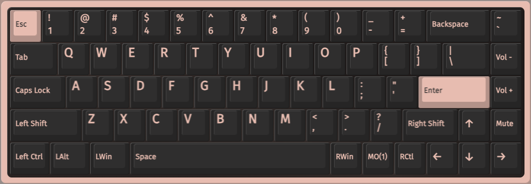
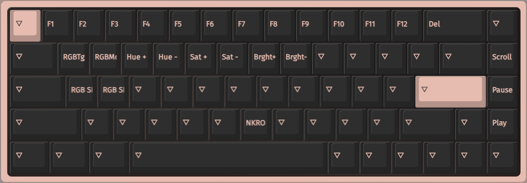

# tofu65v2_macos

## Overview

This QMK keyboard firmware is for [KBDFans](https://kbdfans.com) Tofu65 2.0 (Tofu Jr PCB) adapted for macOS.

This firmware is modified from the original Tofu Jr v1 firmware. See [here](https://github.com/qmk/qmk_firmware/tree/master/keyboards/dztech/tofu/jr).

## Changes

- **NKRO is enabled by default** (macOS does not support 6KRO).
- Modify the keyboard’s default layout to macOS key bindings and add some of my preferred shortcuts. Please refer to the key layout attached for details. Feel free to make any modifications in VIA.
- Add VIA support (the firmware for Tofu Jr in the official QMK firmware repository somehow does not have VIA support enabled).

- Change the hardware name to `TOFU65V2`

## How2Use

1. Download the firmware [here](https://github.com/JerryZhangZZY/tofu65v2_macos/releases/latest/download/tofu65v2_macos.uf2)
2. Unplug the keyboard cable.
3. Press and hold <kbd>ESC</kbd> while reconnecting the keyboard cable.
4. Paste `tofu65v2_macos.uf2` into the pop-up drive.
5. The keyboard will reboot and you are ready to go.

## Appendix

### Layout (keymap)

Layer 0:

Layer 1:

